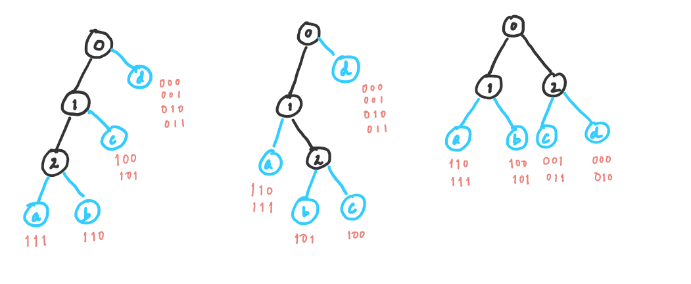

# Tile Shapes and Look-up Table

## Tiles & Tile Shapes

A _**tile**_ is a collection of connected non-leaf nodes of a decision tree. The path connecting any pair of nodes in the tile must fully be contained within the tile. The _**tile size**_ is the number of nodes contained in a tile.

Informally, the _**tile shape**_ is the shape of the region that encloses all nodes in a tile in a diagram of the decision tree. More formally, for a tile size $n_t$, each unique legal binary tree containing $n_t$ nodes (nodes being indistinguishable) corresponds to a tile shape. 

The diagram below enumerates all tile shapes with a tile size of 3.


For a tile size of $n$, the number of tile shapes is given by the following recurrence.

$NTS(n) = \sum_{k=0}^{n-1} NTS(k) \times NTS(n-k-1)$

with $NTS(0) = NTS(1) = 1$.

## Tiled Trees

The diagram below shows how a tiled tree is constructed from a decision tree. The nodes of the tiled tree are either tiles are leaves.


Treebeard maintains the following invariants.
1. All tiles in a tree are the same size $n_t$. If the tiling produces any smaller tiles, these are padded by inserting dummy nodes to make them the required size.
2. Nodes within tiles are always ordered in level order and left to right within a level. The numbering of the nodes in the above diagram shows this node order.
3. Children of a node are numbered from left to right (regardless of level). For example, $l_1$ is the first child of $t_1$, $l_2$ is the second and so on.

## Tile Shapes and Decision Tree Inference

Treebeard uses vector instructions to accelerate decision tree walks. Vector instructions are used to evaluate the predicates of all the nodes in a tile simultaneously. However, once the predicates of all the nodes in the tile are evaluated, computing the next tile to move to, given the outcome of the comparison depends on the tile shape of the current tile. To illustrate this problem, consider the case of tiles of size 3. 

The diagram shows 3 of the 5 possible tile shapes for a tile size of 3. The nodes drawn in black are members of the tile $t_1$. The nodes in blue are the "root nodes" of the children tiles of $t_1$.

To traverse a tile on an input row, first, the predicate of each node in the tile is computed. Subsequently, we need to determine which of the child tiles to move to next. Note that a true predicte (bit value 1) on a node implies a move to the left child and a false predicate (bit value 0) implies a move to the right child.

In the diagram, the bit strings (written in red) show which child we need to move to given the outcomes of the comparison (the bits represent the comparison outcomes of nodes and are in the order of the nodes in the tile -- marked 0, 1 and 2 in the diagram, i.e., the MSB is the predicate outcome of node 0 and the LSB the predicate outcome of node 2). For example, for the first tile shape, if the predicate of all nodes are true (i.e. the comparison outcome is 111), the next node to evaluate is $a$. However, if the predicate of node 1 is false, then we need to move to $d$ regardless of the outcomes of nodes 2 and 3. It is easy to see from the diagram that, depending on the tile shape, the same predicate outcomes can mean moving to different children. For example, for the outcome "011", the next tile is the 4th child (node $d$) for the first two tile shapes while it is the 3rd child for the other tile shape (node $c$).

## Lookup Table (LUT)

A lookup table is used to solve the problem described in the previous section, i.e. given the outcome of the comparisons on all nodes in a tile, determine the child tile we should evaluate next. The LUT is indexed by the tile shape and the comparison outcome. Formally, the LUT is a map.

$LUT : (TileShape, < Boolean \times n_t >) \rightarrow [0, n_t] \subset \mathbb{N} $

where $n_t$ is the tile sizem $< Boolean \times n_t >$ is a vector of $n_t$ booleans. The value returned by the LUT is the index of the child of the current tile that should be evaluated next. For example, if we are evaluating the first tile above, and the result of the comparison is "110", then $LUT(TileShape, 110)=1$ since the tile we need to evaluate next is the tile with node $b$, which is the second child of the current tile. 

In order to realize this LUT in generated code, Treebeard associates a non-negative integer ID with every unique tile shape of the given tile size. The vector of booleans is stored as a 64-bit integer. Therefore, the LUT can be implemented as a 2 dimensional array.

```C++
// n_t is the tile size, NTS(n_t) gives the number of tile shapes 
// with tile size n_t
int16_t LUT[NTS(n_t), pow(2, n_t)];
```

Treebeard computes the values in the LUT statically as the tile size is a compile time constant. The details of how the actual values that go into the LUT are computed by Treebeard are omitted for simplicity.